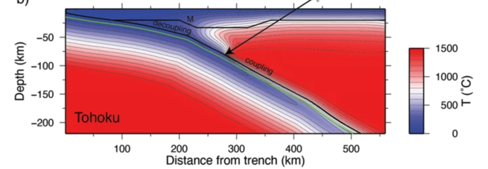

# Summary

Suggested editor: Jed Brown

Suggested referees: Jørgen Dokken, Adam Holt, Scott King.

# Statement of need

Plate tectonics on Earth is the surface expression of the slow convective release of heat from its interior.
Subduction zones form the location of the return flow of mantle convection and are sites of mountain building and significant 
natural hazards in the form of earthquakes and explosive volcanism. 
The depth extent of large and sometimes tsunamogenic earthquakes,
intermediate-depth earthquakes, and melt formation are linked to thermal transitions and 
corresponding thermally activated processes such as metamorphic reactions 
(including those causing dehydration and release of volatile phases such as water and carbon). 
To understand the short- and long-term evolution of the tectonic and geological processes it is critically important to understand
the thermal structure of subduction zones [@vanKeken2023-a].

`FEniCS-SZ` is cool and is based on @Wilson2023.

`FEniCS-SZ` is intended also for classroom use and interactive work via Jupyter notebooks [@fenics-szj] 
that explore the FEM examples in @Wilson2023.
The didactic nature of these tutorials (progressing from the stand-alone Poisson and Stokes equations, reproduction of mantle convection benchmarks, 
to the fully coupledset of time-dependent equations used in the subduction models)
augments the FEniCSX Tutorial [@fenicsx], which is itself built on the FEniCS Tutorial [@Langtangen2016].

# State of the field

Thermal models of subduction zones that are most useful in the prediction of metamorphic dehydration reactions and their role in seismogenesis and seismic structure,
slab dehydration, arc volcanism, and the long term chemical evolution of the Earth require high numerical resolution, 
faithful gridding of material boundaries (such as the slab surface and oceanic Moho), and ability to handle velocity discontinuities along the
seismogenic zone and its extension to about 80 km depth. 
Semi-analytical techniques can be used successfully along the shallow plate interface to limited depth (see discussion and references in @vanKeken2019), 
but the effects of the cornerflow with realistic mantle rheology requires numerical solution of the Stokes and heat equations.
A number of dynamical approaches exist that can be used to trace subduction zone thermal evolution
(@HoltCondit2021, @Gerya2011) but these provide slab evolution models that are difficult to use when 
predicting the thermal structure of present-day subduction zones 
since geometry and convergence parameters such as convergence speed cannot be controlled.
Other workers have provided finite element and finite difference approaches to study the thermal structure 
(e.g. @WadaWang2009; @LeeKing2009; @Lin2010; @ReesJones2018; @vanZelst2023). 
These approaches have shown good comparisons with other codes in a code intercomparison [@vanKeken2008], 
by reproduction of benchmark cases therein,
or in direct intercomparisons [@vanKeken2023-b]. 
Many of these subduction implementations, however, are not readily available as open source software even if they are based on general
open source finite element software.

 

# Software design

# Research impact statement

Reference papers using predicted thermal structure - highlight ability for researchers to expand this to interpolate existing models differently, use different geometries and assumptions for subduction parametrs, wedge rheology, and coupling depth to become a general purpose modeling tool for the yhermal structure of subduction zones worldwide.

Software is based on intensive research experience of two undergraduate students.

Class room use demonstrated by Prof. Geoff Abers (Cornell) in EAS4040 "Geodynamics".

# AI usage disclosure

No information or code was harmed by AI.

# Acknowledgements

We acknowledge support from the National Science Foundation (NSF) grants (EAR-1850634 and EAR-202102) and
the Carnegie Institution for Science through its summer intern programs (SURI, 2023 and EPIIC, 2024) sponsored principally by NSF EAR-2244322.

# References
